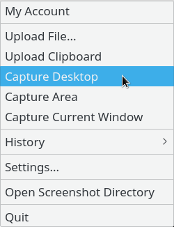

puush-qt
========
A GUI frontend for puush on Linux. This will create a system tray icon and contains similar options to puush from Windows (not all features are, nor probably will be implemented).



## Installing
Arch Linux users can install this from the AUR with `puush-qt`.  
If you aren't on Arch, see [Compiling](#compiling) below.

## Dependencies
`curl scrot`  
`qt5-base`

## Compiling
* Open the .pro file with qt-creator, else you can compile via command line:

```
git clone https://github.com/jplsek/puush-qt  
cd puush-qt  
mkdir build && cd build  
qmake ../src/puush-qt.pro  
make  
sudo make install
```

## Other Information
There are a few quirks with this application.  
1. You must manually select a window after clicking the "screenshot active window" button.  
2. For GNOME users, the active window screenshot may include extra "padding" and contain the backgroud.
3. The cursor may not change when clicking "select area screenshot", just  click and drag, and it should work.

Passwords are not stored. They are forgotten after getting the api key from Puush.

## License
BSD Clause 3
